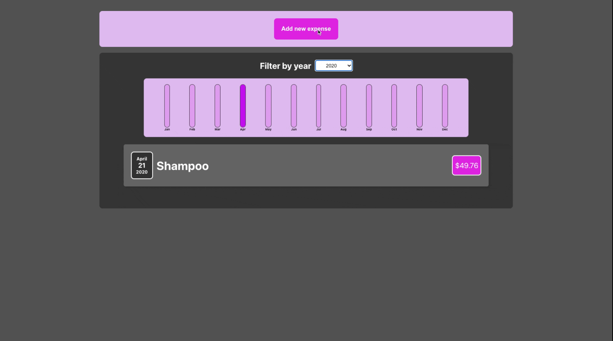

# What is a Expense Tracker

Expense tracker is a program to control our expenses year by year,
we can filter the year in which we want to check our expenses, as well as add new expenses as they arise.

# What I'm learned

- I've learned the good practice of a Component(small component with just one reponsabilit), how to pass Props to my components
- I learned either how to put the state in the parent component and manipulate it from the child component by passing the setter function in the props.

# Technologies 🏷️

# How to use it ⚙️?

# Funcionalidades 💫

# Future features ⏱️
